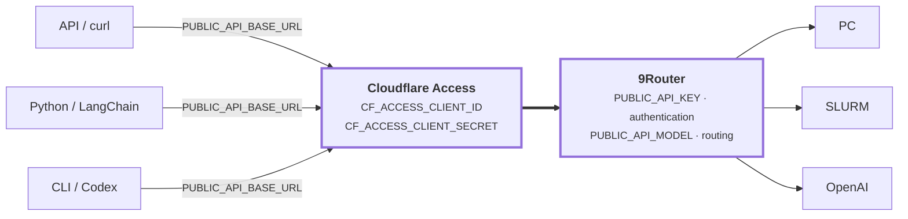

# 9Router Inference Clients

A compact set of API, Python, and CLI clients for a remote 9Router deployment.
Requests pass through Cloudflare Access and are routed to the configured
provider.



The shell scripts require Bash, `curl`, and `jq`. The Python client requires
Python 3.10 or newer.

## Quick start

```bash
cp .public-api.env.example .public-api.env
chmod 600 .public-api.env
```

Set the API URL, model, API key, and Cloudflare Access credentials in
`.public-api.env`.

Run the available clients after configuring `.public-api.env`. The file stays
local, is ignored by Git, and must never be committed.

```bash
./scripts/list-models.sh
./scripts/test-api.sh
./scripts/test-tool-calling.sh

uv sync
uv run scripts/test-langchain.py
uv run scripts/test-langchain.py gpt-5.6-sol  # optional model override

./scripts/start-codex.sh                      # interactive Codex session
```

The LangChain and Codex clients use `PUBLIC_API_MODEL`; pass a model ID as the
first argument to override it. The Codex session stays open for continued
conversation and requires the `codex` CLI to be installed.

`PUBLIC_API_BASE_URL` is the OpenAI-compatible `/v1` base. For example:

```bash
source .public-api.env

curl "${PUBLIC_API_BASE_URL%/}/chat/completions" \
  -H "Content-Type: application/json" \
  -H "Authorization: Bearer ${PUBLIC_API_KEY}" \
  -H "CF-Access-Client-Id: ${CF_ACCESS_CLIENT_ID}" \
  -H "CF-Access-Client-Secret: ${CF_ACCESS_CLIENT_SECRET}" \
  --data "{\"model\":\"${PUBLIC_API_MODEL}\",\"messages\":[{\"role\":\"user\",\"content\":\"Hello\"}]}"
```

## Project layout

```text
.
├── scripts/
│   ├── list-models.sh         # List available model IDs
│   ├── start-codex.sh         # Start an interactive Codex session
│   ├── test-api.sh            # Basic curl smoke test
│   ├── test-langchain.py      # LangChain smoke test
│   └── test-tool-calling.sh   # Multi-turn tool-calling test
├── data/
│   └── models.txt             # Saved model-list snapshot
├── .public-api.env.example    # Environment template
├── pyproject.toml             # Python dependencies
└── README.md
```
